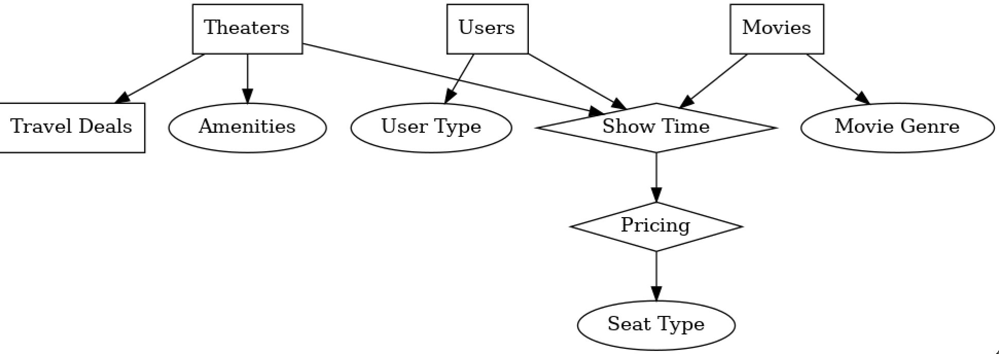
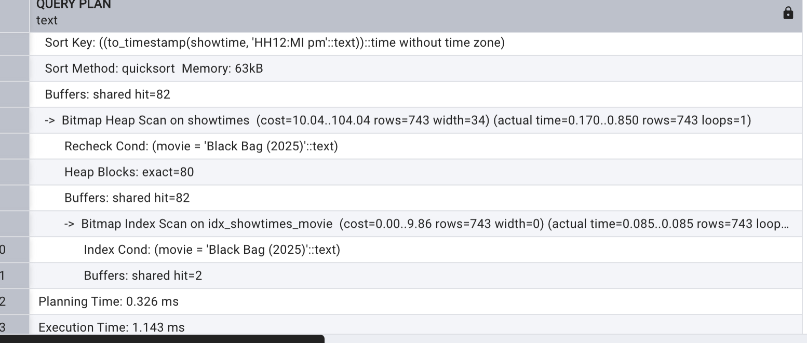

<<<<<<< HEAD
=======

>>>>>>> 0a7ddd3 (Saving latest local README changes before sync)
## CinemaCompass

CinemaCompass is a comprehensive database project designed to streamline the process of finding movie showtimes, booking tickets, and getting relevant travel information. It addresses the challenges of managing dynamic showtime data, user-specific travel paths, and theater amenities by leveraging a robust relational database. This system provides an all-in-one solution for moviegoers and theater administrators, ensuring accurate, real-time information and an improved user experience.

## 🎬 Key Features

- **Real-Time Showtime Information**: Find up-to-date movie schedules for theaters near you. The system efficiently handles frequent updates and corrections to showtime listings.
- **Integrated Travel Details**: Get travel paths, distances, and estimated travel times from your location to the theater.
- **Accessibility Information**: Filter theaters based on accessibility features like wheelchair access and hearing assistance devices.
- **User and Administrator Roles**: Supports both moviegoers searching for films and theater managers updating schedules, pricing, and amenities.

## 🛠️ Technologies Used

- **Data Collection**:
  - **IMDB Scraper**: A forked version of a movie scraper is used to collect regional showtime data, including theater names, movie titles, showtimes, and accessibility markers.
  - **Overpass API**: An API for OpenStreetMap that allows for querying theater locations to relate them to geopositional data and calculate travel directions.
- **Database**: PostgreSQL
- **Schema**: The project uses a comprehensive relational schema to manage relationships between users, theaters, movies, showtimes, pricing, and more.

## 📊 Database Schema

The database is designed to efficiently manage the relationships between all major entities in the system.

### E/R Diagram
This diagram shows the high-level relationships between entities like Theaters, Users, and Movies.



### Relational Schema Diagram
This detailed diagram illustrates the tables, attributes, and foreign key relationships that form the backbone of the database.


## 🚀 Getting Started

To get a local copy up and running, follow these simple steps.

### Prerequisites

You will need a working installation of PostgreSQL.

### Installation

1. Create a new database in PostgreSQL.
2. Run the provided SQL files in the following order to set up the schema and load the data:
   - `01_schema.sql`
   - `02_data.sql`
   - `04_triggers.sql`
3. You can then use the `queries.sql` file to run sample queries against the database. For optimization, apply the `03_indexes.sql` file.

## 📈 Performance Optimization

Indexes have been implemented to optimize query performance. Key queries have shown significant improvements in execution time after indexing was applied.

| Query | Before Indexing | After Indexing |
| :--- | :--- | :--- |
| Q1: Find Showtimes | 13.968 ms | 1.143 ms |
| Q2: Find Nearby Theaters | 0.335 ms | 0.901 ms |
| Q3: Calculate Average Price | 19.679 ms | 16.365 ms |

### Detailed Query Plans

#### Query 1: Find Showtimes for a Movie
An index on the `movie` column of the `showtimes` table reduced the execution time from 13.968 ms to 1.143 ms.



#### Query 2: Find Nearby Theaters
An index on `user_loc` and `distance` in the `travel_paths` table improved query performance significantly.


#### Query 3: Calculate Average Price
Indexing the `showID` on the `pricing` table led to a reduction in execution time for this aggregation query from 19.679 ms to 16.365 ms.


## 💡 Sample Usage

### Inserting a New Showtime
You can easily add new showtimes to the database. The system can be configured to return the newly generated ID.

```sql
INSERT INTO "Showtimes" ("TheaterName", "Movie", "StartTime", "ScreenNumber", "ShowtimeID")
VALUES ('AMC 34th Street 14', 'Mickey 17 (2025)', '7:10 pm', 9, DEFAULT)
RETURNING "ShowtimeID" as newID;


